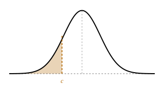
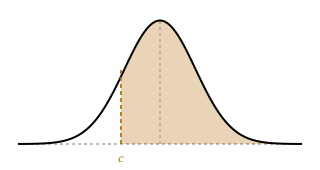

# Adding and editing questions

Questions live in `content/tutorial-1.yml` … `tutorial-5.yml`. There is no build
step: edit the YAML, push, and the site picks it up. You can do this entirely in
GitHub's web editor.

Run `python tools/verify_answers.py` before pushing — CI runs it anyway, but it
is faster to find a problem locally.

---

## Shape of a file

```yaml
tutorial: 1
title: Descriptive Statistics and Data Visualisation
intro: |
  Markdown. Shown under the title.
learning_outcomes:
  - One bullet each.
datasets:
  - id: travel-times
    name: Car travel time survey
    csv: travel-times.csv          # becomes a download link
    sheet: T1 Travel Times         # sheet name in the workbook
supplementary: |
  Markdown. Shown in a "Before you start" card.
questions:
  - id: t1-q1                      # must be unique across ALL files
    title: Question 1 — Types of data
    dataset_label: T1 Travel Times # optional badge in the header
    prompt: |
      Markdown. The question itself.
    note: |
      Optional. Rendered as a highlighted callout.
    steps: [ ... ]
    solution: { ... }              # optional, for the question as a whole
```

Step ids are generated as `<question id>-s<index>`, and those ids are what
progress is stored against. **Reordering or deleting steps invalidates saved
progress for that question** — harmless, but worth knowing.

---

## Every step

```yaml
- kind: numeric
  ask: What is the sample standard deviation?     # markdown, inline
  body: |                                          # optional block markdown
    Extra explanation shown above the input.
  hints:                                           # revealed one at a time
    - First nudge.
    - Bigger nudge.
  solution:                                        # revealed on request or
    working: |                                     # after two wrong attempts
      Markdown, shown first.
    excel: "=STDEV.S(B4:B58)"
    r: "sd(x)"
    python: "df.x.std()"
    note: |
      Optional caveat, shown in a callout under the code tabs.
  verify: stdev_s(travel)                          # checked in CI, see below
```

`excel`, `r` and `python` become tabs, and the student's chosen language is
remembered site-wide. Excel is expected on every step; add the others where
they say something useful. If a language is missing, the tab simply does not
appear.

---

## Step kinds

### `numeric`

```yaml
- kind: numeric
  ask: What is the mean travel time?
  answer: 22.58
  also_accept: [22.6]            # optional alternates, same tolerance
  tol: {abs: 0.02}               # or {rel: 0.01}, or both, or a bare number
  unit: minutes                  # optional suffix beside the box
  precision: |                   # optional; see "Precision" below
    Give your answer to 4 decimal places, or in scientific notation.
  traps:
    - value: 19
      tol: {abs: 0.02}           # optional; defaults to the step's tolerance
      feedback: |
        That is the **median**, not the mean.
  on_correct: |                  # optional extra note when they get it right
    Notice the mean and median disagree — the data is skewed.
  on_wrong: |                    # optional; overrides the generic message
    Check your range covers all 55 observations.
```

Input parsing is forgiving: `1,234.5`, `1.2e-3`, `12%`, `1/3` and a leading `=`
all work. A sign-flipped answer is caught automatically with its own message, so
you do not need a trap for that.

### `interval`

Two boxes, checked as a pair.

```yaml
- kind: interval
  ask: Give the 95% confidence interval.
  lower: 19.88
  upper: 24.70
  tol: {abs: 0.03}
  unit: tonnes
  n: 38                          # enables the "you used s, not s/√n" diagnosis
  traps: [ ... ]                 # matched against either bound
```

Setting `n` is worth doing: it lets the checker recognise an interval that is
correctly centred but √n times too wide and name the cause.

### `choice` and `multi`

```yaml
- kind: choice
  prose: true                    # renders options in body text, not monospace
  ask: Which function is correct?
  options:
    - value: STDEV.S
      correct: true
      feedback: |                # optional even when correct
        Right — this is a sample, so the n−1 divisor applies.
    - value: STDEV.P
      feedback: |                # REQUIRED on every distractor
        STDEV.P treats these as the whole population.
```

Leave `prose` out for function names and short values; set it to `true` for
full sentences. `multi` is identical but allows several `correct: true` options.

**Every distractor must have `feedback`.** The schema check enforces it — a
distractor without an explanation is a wrong answer that teaches nothing.

### `table`

```yaml
- kind: table
  ask: Complete these rows.
  tol: {abs: 0.002}
  corner: "Bin"                              # top-left header cell
  columns: ["Relative frequency", "Density"]
  rows: ["(10,15]", "(25,30]"]
  given:                                     # pre-filled, read-only cells
    "0,0": "16"                              # "row,col"
  cells:
    - key: r0c1                              # any unique string
      row: 0
      col: 1
      answer: 0.058
      tol: {abs: 0.001}                      # optional per-cell override
      traps: [ ... ]                         # optional per-cell traps
  col_feedback:
    1: |
      Every cell in this column is out — you have not divided by the class width.
  row_feedback:
    0: |
      This whole row is wrong.
```

`col_feedback` and `row_feedback` fire when *all* the wrong cells fall in one
column or row. That is the most valuable feedback a table can give, because it
identifies a systematic misunderstanding rather than an arithmetic slip.

### `formula`

The student types an Excel formula. Case, whitespace, a leading `=`, `$`
anchors, `;` separators and `1`/`TRUE` are all normalised away.

```yaml
- kind: formula
  ask: Write the formula.
  answer: "=NORM.DIST(15,25,12,TRUE)"
  also_accept: ["=NORM.S.DIST((15-25)/12,TRUE)"]
  traps:
    - value: "=NORM.INV(15,25,12)"
      feedback: |
        NORM.INV goes from a probability to a value; you need the reverse.
    - pattern: "^NORM\\.DIST\\(.*FALSE\\)$"    # regex alternative to `value`
      feedback: |
        Set the cumulative flag to TRUE.
```

Using the right function with the wrong arguments is detected automatically and
gets its own message.

### `decision`

```yaml
- kind: decision
  ask: What do you conclude at α = 0.05?
  answer: reject                 # 'reject' or 'fail'
  reasons:
    - value: p = 0.0008 is less than α = 0.05
      correct: true
    - value: The z-score is negative
      feedback: |
        A negative z gives the direction, not the significance.
```

Both halves must be right. This is what catches a student who reaches the right
conclusion from the wrong comparison.

### `hypothesis`

```yaml
- kind: hypothesis
  ask: Set up the test.
  parts:
    - key: h0
      label: Null hypothesis
      options:
        - value: "μ = 12"
          correct: true
        - value: "μ = 10.9"
          feedback: |
            10.9 is the sample mean. H₀ is about the population.
```

Use as many `parts` as the question needs — typically H₀, H₁ and the number of
tails, sometimes which test to use. This turns an ungradable free-text task into
a gradable one without losing the point of it.

### `freetext`

Not auto-marked. The student writes an answer, then compares it against a model
answer and ticks a rubric.

```yaml
- kind: freetext
  ask: Explain what this means for someone without a statistics background.
  min_length: 80                 # characters before the model answer unlocks
  rubric:
    - Says which statistics moved and which did not.
    - Explains why squaring the deviations makes spread sensitive to outliers.
  solution:
    working: |
      **Model answer.** …
```

Recorded as *self-assessed*, which counts towards progress but is not claimed
as correct.

### `sketch`

Pick the diagram matching a statement. Figures come from
`tools/make_figures.py`.

```yaml
- kind: sketch
  ask: "**1 − P(X > c)**"
  options:
    - caption: Area to the left of c
      correct: true
      svg: ''
    - caption: Area to the right of c
      svg: ''
      feedback: |
        That is P(X > c) itself; the statement asks for 1 minus that.
```

---

## Precision

Every `numeric`, `interval` and `table` step displays a line telling the
student how precisely to answer — *"Give your answer to 2 decimal places."*

**You do not normally need to write it.** It is derived from the decimal places
in your `answer`, so it is never less precise than the tolerance requires.
Integers give "as a whole number"; very large or very small values give
"in scientific notation, to 3 significant figures".

Override it when the derived wording reads badly:

```yaml
precision: Give your answer to 4 decimal places, or in scientific notation.
precision: false      # suppress the line entirely
```

A p-value of `0.00084` derives "to 5 decimal places", which is technically
right but odd — that is the kind of case worth overriding.

## Revealing the answer

**Every gradable step can reveal its answer, whether or not you wrote a
`solution:` block.** If there is no block, the engine derives an *Answer:* line
from the step — the correct option, the numeric answer, both interval bounds, a
filled-in table, and so on.

So a `solution:` block is for the *working* — the reasoning, the Excel/R/Python
formulas, the caveat. You never have to add one just so the button does
something.

The one exception is `freetext`, which has no derivable answer: give those a
`solution.working` containing the model answer, or the student has nothing to
mark themselves against.

## `verify:` — how CI checks your answer

Any step may carry a `verify:` expression. It is evaluated in Python and
compared against the `answer:` you wrote beside it, using the step's tolerance.

```yaml
answer: 10.68
tol: {abs: 0.02}
verify: stdev_s(travel)
```

This is what stops the content and the data drifting apart. **Add one wherever
the answer is computable** — it costs a line and it means a wrong answer key can
never reach a student.

Return a **list** for `interval` (lower, upper) and for `table` (one value per
cell, in the order the cells are declared).

Available names:

| | |
|---|---|
| Datasets | `travel`, `travel_no_outlier`, `fuel`, `hgv`, `junction_before`, `junction_after`, `junction_diff`, `warning`, `reaction` |
| Excel-compatible stats | `stdev_s`, `var_s`, `skew_excel`, `quartile_inc`, `mode_sngl` |
| Distributions | `NORM_DIST`, `NORM_INV`, `NORM_S_DIST`, `NORM_S_INV`, `BINOM_DIST`, `POISSON_DIST`, `T_INV`, `T_INV_2T`, `T_DIST_2T`, `T_DIST_RT`, `CHISQ_INV_RT`, `CHISQ_DIST_RT` |
| Libraries | `np`, `math`, `stats` (scipy.stats) |

Builtins are restricted to a small safe set (`abs`, `float`, `int`, `len`,
`list`, `max`, `min`, `pow`, `range`, `round`, `sorted`, `sum`, `zip`).

---

## YAML gotchas

- **Scientific notation needs a sign:** `3.87e+25` parses as a number,
  `3.87e25` parses as a *string*. Always include the `+`.
- **Quote anything starting with a special character.** A value beginning with
  `*`, `&`, `%`, `@`, `` ` `` or `?` must be quoted.
- **Use `|` block scalars for prose.** Safer than trying to escape a long line,
  and it keeps markdown readable in the diff.
- **Colons inside plain strings break parsing.** `ask: Note: this is wrong`
  fails; quote it or use a block scalar.

---

## House style

Many students on this module do not have English as a first language, and the
statistics is already demanding. Every word should do work.

**Rules**

1. **Short sentences.** One idea each. Split a long sentence into two.
2. **Simple words.** Write "use", not "utilise". Write "so", not "hence".
   Write "but", not "however". Write "enough", not "sufficient".
3. **No idioms.** "Trips people up", "the giveaway", "bear in mind" and similar
   phrases do not translate. Say what you mean directly.
4. **No commentary on the material.** Do not write "this question is designed
   to…", "the point of asking is…", "worth being clear about why". Teach the
   content; do not describe the teaching.
5. **State instructions as steps.** If a task has four actions in Excel,
   number them. Do not bury them in a paragraph.
6. **Cut filler.** "It is worth noting that", "in practice", "of course",
   "genuinely", "simply", "just", "actually" almost always delete cleanly.
7. **Prefer a full stop to a dash.** Long sentences held together by dashes are
   the main thing to avoid.

**Example**

Before:

> `STDEV.P` treats these 55 observations as the entire population of journeys
> ever made between these two points. It is a survey, so it is a sample: use
> `STDEV.S`. The difference here is small (10.58 against 10.68) but the
> reasoning matters, and it is the single most common slip in this tutorial.

After:

> `STDEV.P` treats the 55 values as every journey ever made on this route. A
> survey is a sample, so use `STDEV.S`.

## Writing good feedback

The feedback is the teaching. Some things that make it work:

- **Name the mistake. Do not only say the answer is wrong.** "This is
  `STDEV.P`, the population formula" is better than "incorrect".
- **Say why it matters**, not only what to type. The student needs the idea,
  not just a correction.
- **Treat near-misses differently from wrong methods.** A student who rounded
  differently has not made the same mistake as one who used the wrong function.
- **Use `on_correct` to add something.** The word "Correct" is already shown.
  Use the space for a point the student can take forward.
- **Point at the mathematics.** Do not lecture the student.
